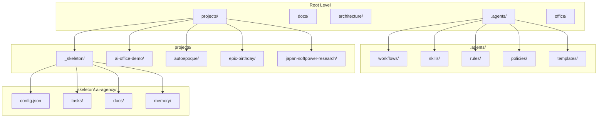
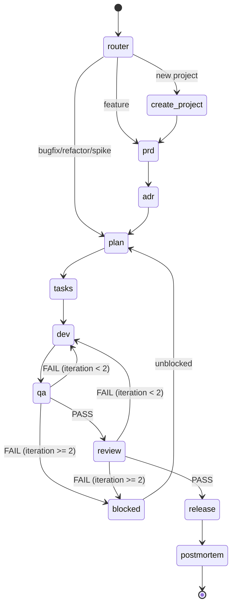
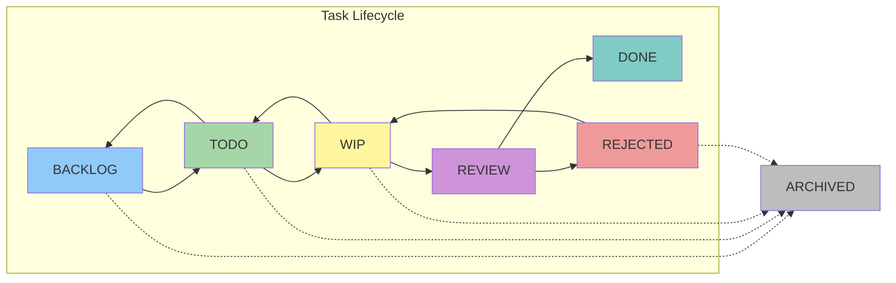
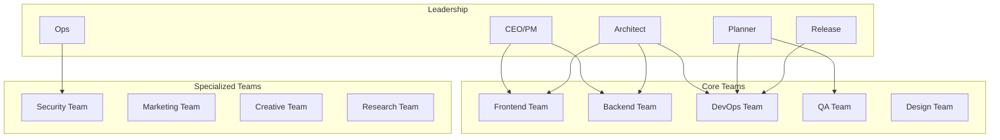
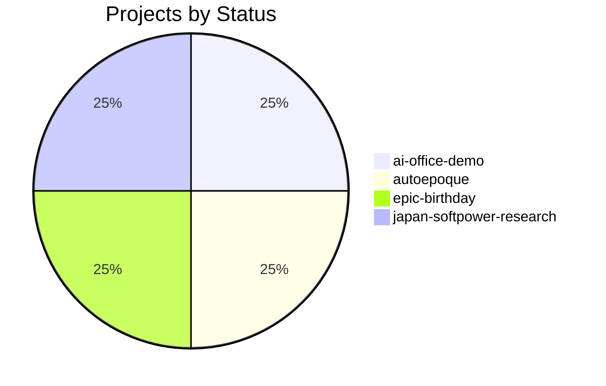
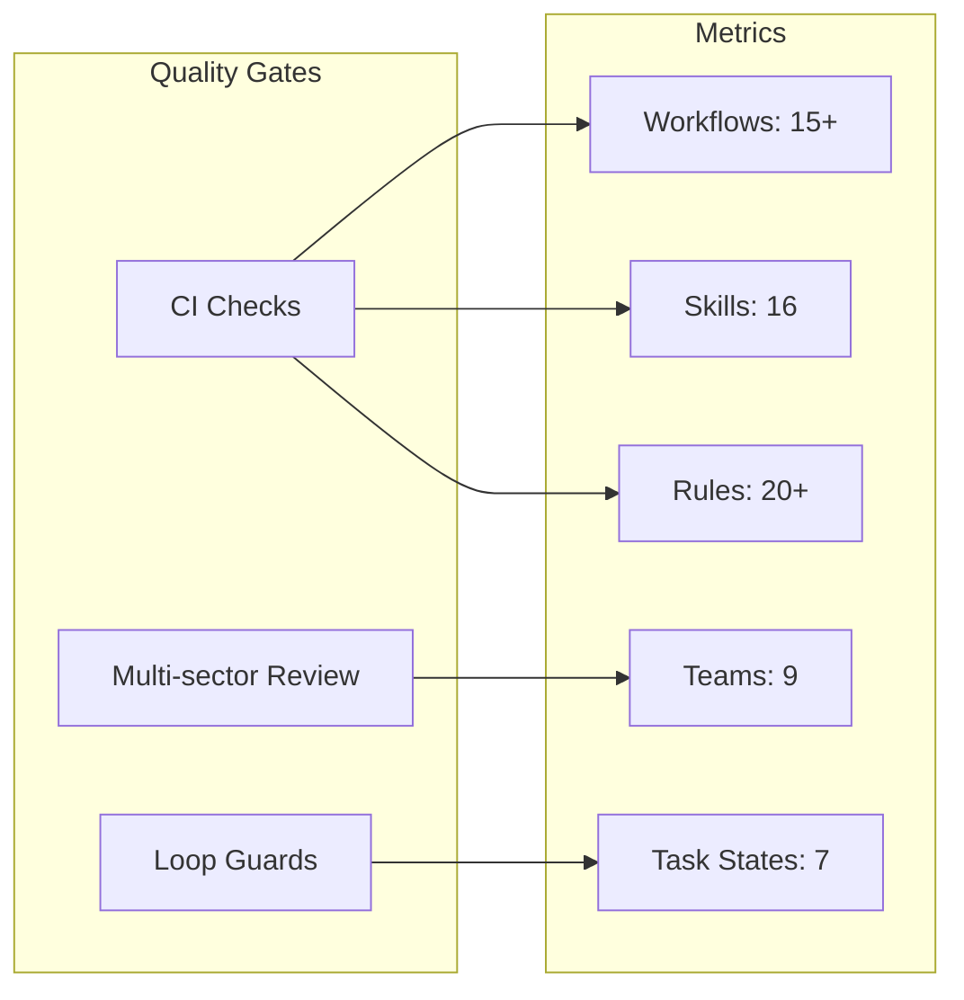
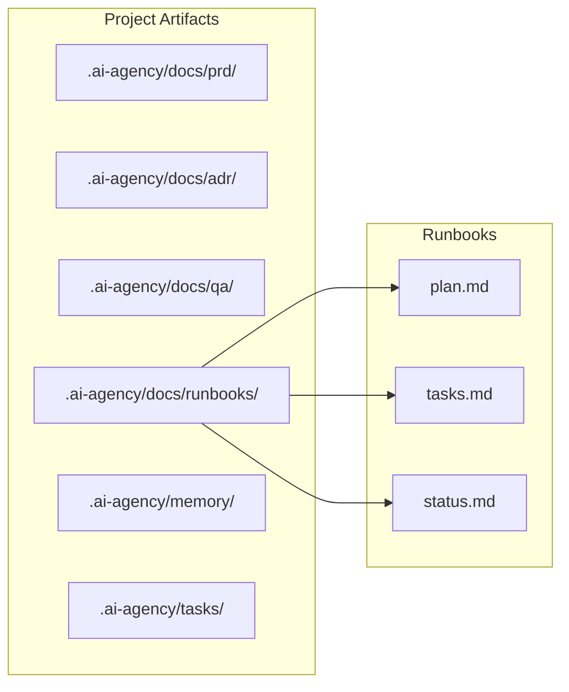

# AI Office Framework Status

> **Auto-generated document** - Updated on: 2026-03-09
> This document is automatically updated when the metaframework is used.

---

## Framework Structure

---

## Workflow State Machine

---

## Kanban Task States

---

## Teams Structure

---

## Active Projects Overview

### Project Details

| Project | Status | Last Updated | Tasks |
|---------|--------|--------------|-------|
| ai-office-demo | ✅ Active | 2026-03-07 | See `.ai-agency/tasks/` |
| autoepoque | 🔄 In Progress | TBD | Minimal setup |
| epic-birthday | 🔄 In Progress | TBD | Has root docs (migrate) |
| japan-softpower-research | 🔄 In Progress | TBD | Minimal setup |

---

## Framework Health Metrics

---

## Artifact Communication Contract

---

## Update Log

| Date | Action | Updated By |
|------|--------|------------|
| 2026-03-09 | Initial creation | Framework Review |
| | | |

---

> **Note:** This document should be updated by workflows:
> - `00_router` - When routing new requests
> - `01_create_project` - When creating new projects
> - `30_plan_tasks` - When task breakdown changes
> - `50_qa_validate` - When QA status changes
> - `60_review_merge` - When review status changes
> - `90_postmortem_memory` - When project completes
