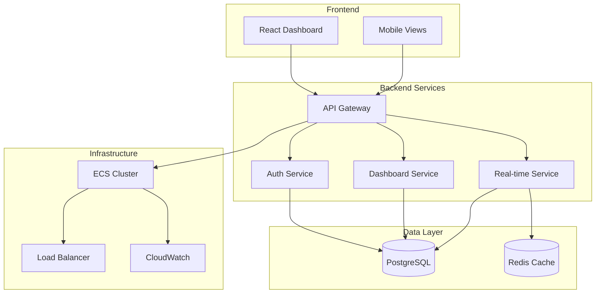

# ADR-001: DataFlow Dashboard Architecture

**Date**: 2026-03-11  
**Status**: Accepted  
**Impact**: High  

## Context
DataFlow Analytics needs a real-time dashboard system that integrates with their existing PostgreSQL database while meeting SOC2 compliance requirements.

## Decision
We will implement a microservices architecture with:
- Frontend: React SPA with TypeScript
- Backend API: Node.js + Express
- Database: Existing PostgreSQL (read replicas)
- Real-time: WebSocket connections for live updates
- Deployment: AWS ECS with Application Load Balancer

## Alternatives Considered
1. **Monolithic Node.js app** - Rejected due to scalability concerns
2. **Serverless functions** - Rejected due to WebSocket complexity
3. **Vue.js frontend** - Rejected due to team React expertise

## Architecture Diagram

## Security Requirements
- OAuth 2.0 + JWT authentication
- Role-based access control (RBAC)
- API rate limiting
- Database connection encryption
- SOC2 audit logging

## Performance Targets
- Page load: < 2 seconds
- API response: < 500ms
- Real-time updates: < 100ms latency
- Concurrent users: 500+

## Consequences
- **Positive**: Scalable, maintainable, meets requirements
- **Negative**: Increased complexity, higher operational overhead
- **Neutral**: Requires new skills (Redis, WebSocket management)

---

**Approved by**: Alex Rivera (Architect)  
**Review Date**: 2026-03-18
