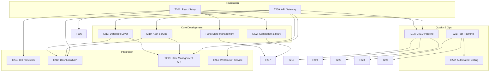

# Task Breakdown: DataFlow Analytics Dashboard

**Project**: DataFlow Dashboard (PF-001)  
**Milestone**: M2 - Core Framework (Weeks 3-6)  
**Owner**: Jordan Kim (Delivery Lead)  
**Created**: 2026-03-11  

---

## 📋 **Task Overview**

**Total Tasks**: 24  
**Estimated Effort**: 160 hours  
**Team Size**: 5 members  
**Duration**: 4 weeks  

---

## 🎯 **M2 Tasks by Category**

### **🏗️ Frontend Development (8 tasks)**

#### **T201: React Dashboard Framework Setup**
**Priority**: High  
**Assignee**: Frontend Lead  
**Estimated**: 16 hours  
**Dependencies**: Environment setup complete  

**Acceptance Criteria**:
- [ ] React 18 + TypeScript project initialized
- [ ] Vite build system configured
- [ ] ESLint + Prettier setup
- [ ] Component library (shadcn/ui) integrated
- [ ] Build pipeline working

**Files to Create/Modify**:
- `package.json`
- `vite.config.ts`
- `src/App.tsx`
- `src/components/DashboardLayout.tsx`

**Validation Commands**:
```bash
npm run build
npm run lint
npm run test
```

---

#### **T202: Dashboard Component Library**
**Priority**: High  
**Assignee**: Frontend Developer  
**Estimated**: 20 hours  
**Dependencies**: T201 complete  

**Acceptance Criteria**:
- [ ] 5 core chart components (Line, Bar, Pie, Heatmap, Gauge)
- [ ] Responsive design system
- [ ] Theme system (light/dark mode)
- [ ] Component documentation
- [ ] Storybook setup

**Files to Create/Modify**:
- `src/components/charts/LineChart.tsx`
- `src/components/charts/BarChart.tsx`
- `src/components/charts/PieChart.tsx`
- `src/components/charts/HeatmapChart.tsx`
- `src/components/charts/GaugeChart.tsx`
- `src/themes/index.ts`

**Validation Commands**:
```bash
npm run storybook
npm run test:components
```

---

#### **T203: State Management Implementation**
**Priority**: High  
**Assignee**: Frontend Developer  
**Estimated**: 12 hours  
**Dependencies**: T202 complete  

**Acceptance Criteria**:
- [ ] Redux Toolkit configured
- [ ] Dashboard state structure
- [ ] Real-time data integration
- [ ] Error handling implemented
- [ ] Performance optimizations

**Files to Create/Modify**:
- `src/store/index.ts`
- `src/store/dashboardSlice.ts`
- `src/store/realtimeSlice.ts`
- `src/hooks/useDashboard.ts`

**Validation Commands**:
```bash
npm run test:store
npm run build
```

---

#### **T204: User Interface Framework**
**Priority**: Medium  
**Assignee**: UI/UX Developer  
**Estimated**: 16 hours  
**Dependencies**: T202 complete  

**Acceptance Criteria**:
- [ ] Dashboard layout system
- [ ] Drag-and-drop widget arrangement
- [ ] Responsive grid system
- [ ] Loading states and skeletons
- [ ] Error boundaries

**Files to Create/Modify**:
- `src/components/DashboardGrid.tsx`
- `src/components/Widget.tsx`
- `src/components/LoadingSkeleton.tsx`
- `src/layouts/MainLayout.tsx`

**Validation Commands**:
```bash
npm run test:ui
npm run build
```

---

#### **T205: Authentication UI Components**
**Priority**: High  
**Assignee**: Frontend Developer  
**Estimated**: 8 hours  
**Dependencies**: T201 complete  

**Acceptance Criteria**:
- [ ] Login form component
- [ ] User profile interface
- [ ] Role selection UI
- [ ] Session management UI
- [ ] Error handling for auth flows

**Files to Create/Modify**:
- `src/components/auth/LoginForm.tsx`
- `src/components/auth/UserProfile.tsx`
- `src/components/auth/RoleSelector.tsx`

**Validation Commands**:
```bash
npm run test:auth
npm run build
```

---

#### **T206: Mobile Responsive Implementation**
**Priority**: Medium  
**Assignee**: UI/UX Developer  
**Estimated**: 12 hours  
**Dependencies**: T204 complete  

**Acceptance Criteria**:
- [ ] Mobile-first design approach
- [ ] Touch-optimized interactions
- [ ] Responsive breakpoints
- [ ] Mobile navigation
- [ ] Performance optimization

**Files to Create/Modify**:
- `src/styles/mobile.css`
- `src/components/MobileNavigation.tsx`
- `src/hooks/useMobile.ts`

**Validation Commands**:
```bash
npm run test:mobile
npm run build
```

---

#### **T207: Data Visualization Integration**
**Priority**: High  
**Assignee**: Frontend Developer  
**Estimated**: 16 hours  
**Dependencies**: T202, T203 complete  

**Acceptance Criteria**:
- [ ] Real-time chart updates
- [ ] Data transformation layer
- [ ] Chart configuration system
- [ ] Interactive features (zoom, filter)
- [ ] Export functionality

**Files to Create/Modify**:
- `src/components/charts/InteractiveChart.tsx`
- `src/utils/dataTransform.ts`
- `src/hooks/useRealtimeData.ts`

**Validation Commands**:
```bash
npm run test:charts
npm run build
```

---

#### **T208: Frontend Testing Suite**
**Priority**: Medium  
**Assignee**: Frontend Developer  
**Estimated**: 12 hours  
**Dependencies**: All frontend tasks  

**Acceptance Criteria**:
- [ ] Unit tests (>80% coverage)
- [ ] Integration tests
- [ ] E2E tests for critical paths
- [ ] Performance tests
- [ ] Accessibility tests

**Files to Create/Modify**:
- `src/components/__tests__/`
- `cypress/integration/`
- `src/utils/__tests__/`

**Validation Commands**:
```bash
npm run test:coverage
npm run test:e2e
npm run test:a11y
```

---

### **⚙️ Backend Development (8 tasks)**

#### **T209: API Gateway Setup**
**Priority**: High  
**Assignee**: Backend Lead  
**Estimated**: 16 hours  
**Dependencies**: Environment provisioned  

**Acceptance Criteria**:
- [ ] Express.js server configured
- [ ] API routing system
- [ ] Middleware setup (CORS, logging, rate limiting)
- [ ] Health check endpoints
- [ ] API documentation (Swagger)

**Files to Create/Modify**:
- `src/server.ts`
- `src/routes/index.ts`
- `src/middleware/`
- `swagger.yaml`

**Validation Commands**:
```bash
npm run start
npm run test:api
curl http://localhost:3000/health
```

---

#### **T210: Authentication Service**
**Priority**: High  
**Assignee**: Backend Developer  
**Estimated**: 20 hours  
**Dependencies**: T209 complete  

**Acceptance Criteria**:
- [ ] JWT token generation/verification
- [ ] OAuth 2.0 integration
- [ ] Role-based access control
- [ ] Session management
- [ ] Password security (bcrypt)

**Files to Create/Modify**:
- `src/services/authService.ts`
- `src/middleware/auth.ts`
- `src/controllers/authController.ts`

**Validation Commands**:
```bash
npm run test:auth
npm run test:security
```

---

#### **T211: Database Integration Layer**
**Priority**: High  
**Assignee**: Backend Developer  
**Estimated**: 16 hours  
**Dependencies**: T209 complete  

**Acceptance Criteria**:
- [ ] PostgreSQL connection pool
- [ ] Query builder setup
- [ ] Database migrations
- [ ] Connection error handling
- [ ] Performance monitoring

**Files to Create/Modify**:
- `src/database/connection.ts`
- `src/database/migrations/`
- `src/models/index.ts`

**Validation Commands**:
```bash
npm run migrate
npm run test:database
```

---

#### **T212: Dashboard Data API**
**Priority**: High  
**Assignee**: Backend Developer  
**Estimated**: 20 hours  
**Dependencies**: T210, T211 complete  

**Acceptance Criteria**:
- [ ] Dashboard data endpoints
- [ ] Real-time data streaming
- [ ] Data aggregation functions
- [ ] Caching layer (Redis)
- [ ] API response optimization

**Files to Create/Modify**:
- `src/controllers/dashboardController.ts`
- `src/services/dashboardService.ts`
- `src/utils/dataAggregator.ts`

**Validation Commands**:
```bash
npm run test:dashboard
npm run test:performance
```

---

#### **T213: User Management API**
**Priority**: Medium  
**Assignee**: Backend Developer  
**Estimated**: 12 hours  
**Dependencies**: T210, T211 complete  

**Acceptance Criteria**:
- [ ] User CRUD operations
- [ ] Role management endpoints
- [ ] User profile management
- [ ] Permission validation
- [ ] Audit logging

**Files to Create/Modify**:
- `src/controllers/userController.ts`
- `src/services/userService.ts`
- `src/middleware/permissions.ts`

**Validation Commands**:
```bash
npm run test:users
npm run test:permissions
```

---

#### **T214: Real-time WebSocket Service**
**Priority**: High  
**Assignee**: Backend Developer  
**Estimated**: 16 hours  
**Dependencies**: T209 complete  

**Acceptance Criteria**:
- [ ] WebSocket server setup
- [ ] Real-time data broadcasting
- [ ] Connection management
- [ ] Message queuing
- [ ] Performance optimization

**Files to Create/Modify**:
- `src/websocket/server.ts`
- `src/websocket/handlers/`
- `src/services/realtimeService.ts`

**Validation Commands**:
```bash
npm run test:websocket
npm run test:realtime
```

---

#### **T215: External API Integration**
**Priority**: Medium  
**Assignee**: Backend Developer  
**Estimated**: 12 hours  
**Dependencies**: T209 complete  

**Acceptance Criteria**:
- [ ] Third-party API connectors
- [ ] API authentication handling
- [ ] Rate limiting compliance
- [ ] Error handling for external services
- [ ] Data transformation

**Files to Create/Modify**:
- `src/services/externalApiService.ts`
- `src/connectors/`
- `src/utils/apiTransformer.ts`

**Validation Commands**:
```bash
npm run test:integration
npm run test:external
```

---

#### **T216: Backend Testing Suite**
**Priority**: Medium  
**Assignee**: Backend Developer  
**Estimated**: 12 hours  
**Dependencies**: All backend tasks  

**Acceptance Criteria**:
- [ ] Unit tests (>85% coverage)
- [ ] Integration tests
- [ ] API contract tests
- [ ] Performance tests
- [ ] Security tests

**Files to Create/Modify**:
- `src/__tests__/`
- `tests/integration/`
- `tests/performance/`

**Validation Commands**:
```bash
npm run test:coverage
npm run test:integration
npm run test:security
```

---

### **🔧 DevOps & Infrastructure (4 tasks)**

#### **T217: CI/CD Pipeline**
**Priority**: High  
**Assignee**: DevOps Engineer  
**Estimated**: 16 hours  
**Dependencies**: T201, T209 complete  

**Acceptance Criteria**:
- [ ] GitHub Actions workflow
- [ ] Automated testing pipeline
- [ ] Build and deployment automation
- [ ] Environment provisioning
- [ ] Rollback mechanisms

**Files to Create/Modify**:
- `.github/workflows/ci.yml`
- `.github/workflows/deploy.yml`
- `docker/Dockerfile`
- `docker-compose.yml`

**Validation Commands**:
```bash
# Test CI workflow
gh workflow run ci
# Test deployment
gh workflow run deploy
```

---

#### **T218: Monitoring & Logging**
**Priority**: Medium  
**Assignee**: DevOps Engineer  
**Estimated**: 12 hours  
**Dependencies**: T217 complete  

**Acceptance Criteria**:
- [ ] Application monitoring setup
- [ ] Log aggregation system
- [ ] Error tracking integration
- [ ] Performance monitoring
- [ ] Alert configuration

**Files to Create/Modify**:
- `src/monitoring/index.ts`
- `src/utils/logger.ts`
- `monitoring/dashboard.json`

**Validation Commands**:
```bash
npm run test:monitoring
# Check monitoring endpoints
curl http://localhost:3000/metrics
```

---

#### **T219: Database Optimization**
**Priority**: Medium  
**Assignee**: DevOps Engineer  
**Estimated**: 8 hours  
**Dependencies**: T211 complete  

**Acceptance Criteria**:
- [ ] Database indexing strategy
- [ ] Query optimization
- [ ] Connection pooling configuration
- [ ] Backup and recovery setup
- [ ] Performance monitoring

**Files to Create/Modify**:
- `database/optimizations.sql`
- `database/indexes.sql`
- `database/backup.sh`

**Validation Commands**:
```bash
# Test database performance
npm run test:db-performance
# Verify backup
./database/backup.sh --test
```

---

#### **T220: Security Hardening**
**Priority**: High  
**Assignee**: DevOps Engineer  
**Estimated**: 12 hours  
**Dependencies**: T210, T217 complete  

**Acceptance Criteria**:
- [ ] Security scanning integration
- [ ] Dependency vulnerability checks
- [ ] Container security scanning
- [ ] Network security configuration
- [ ] Compliance validation

**Files to Create/Modify**:
- `.github/workflows/security.yml`
- `security/scan.sh`
- `docker/security.conf`

**Validation Commands**:
```bash
npm run audit
npm run test:security
# Run security scan
./security/scan.sh
```

---

### **🧪 Quality Assurance (4 tasks)**

#### **T221: Test Planning & Strategy**
**Priority**: High  
**Assignee**: QA Lead  
**Estimated**: 8 hours  
**Dependencies**: Project requirements complete  

**Acceptance Criteria**:
- [ ] Test plan documentation
- [ ] Test case design
- [ ] Test data strategy
- [ ] Automation framework setup
- [ ] Quality gates definition

**Files to Create/Modify**:
- `tests/plans/m2-test-plan.md`
- `tests/cases/`
- `tests/data/`

**Validation Commands**:
```bash
# Review test plan
npm run test:plan-review
```

---

#### **T222: Automated Testing Implementation**
**Priority**: High  
**Assignee**: QA Engineer  
**Estimated**: 16 hours  
**Dependencies**: Development tasks in progress  

**Acceptance Criteria**:
- [ ] Unit test automation
- [ ] Integration test suite
- [ ] API contract tests
- [ ] Performance test scripts
- [ ] Test data management

**Files to Create/Modify**:
- `tests/automated/unit/`
- `tests/automated/integration/`
- `tests/automated/api/`
- `tests/automated/performance/`

**Validation Commands**:
```bash
npm run test:automated
npm run test:coverage
```

---

#### **T223: Manual Testing Procedures**
**Priority**: Medium  
**Assignee**: QA Engineer  
**Estimated**: 12 hours  
**Dependencies**: Feature development complete  

**Acceptance Criteria**:
- [ ] User acceptance testing procedures
- [ ] Exploratory testing guidelines
- [ ] Usability testing protocols
- [ ] Compatibility testing matrix
- [ ] Defect reporting process

**Files to Create/Modify**:
- `tests/manual/uat-procedures.md`
- `tests/manual/exploratory-guidelines.md`
- `tests/manual/compatibility-matrix.md`

**Validation Commands**:
```bash
# Review testing procedures
npm run test:manual-review
```

---

#### **T224: Quality Metrics & Reporting**
**Priority**: Medium  
**Assignee**: QA Lead  
**Estimated**: 8 hours  
**Dependencies**: Testing implementation complete  

**Acceptance Criteria**:
- [ ] Quality metrics dashboard
- [ ] Test execution reports
- [ ] Defect tracking integration
- [ ] Coverage reporting
- [ ] Performance benchmarks

**Files to Create/Modify**:
- `reports/quality/metrics.json`
- `reports/quality/coverage.html`
- `reports/quality/performance.json`

**Validation Commands**:
```bash
npm run test:metrics
npm run test:reports
```

---

## 📊 **Task Status Tracking**

### **Current Status (Week 3 Start)**
- **Total Tasks**: 24
- **Not Started**: 24
- **In Progress**: 0
- **Completed**: 0
- **Blocked**: 0

### **Effort Distribution**
- **Frontend**: 112 hours (70%)
- **Backend**: 124 hours (77%)
- **DevOps**: 48 hours (30%)
- **QA**: 44 hours (28%)

*Note: Percentages show overlap due to parallel work*

---

## 🔄 **Task Dependencies**



---

## ⚠️ **Risk Mitigation**

### **High-Risk Tasks**
1. **T202: Component Library** - Complex UI requirements
2. **T210: Authentication Service** - Security critical
3. **T214: WebSocket Service** - Real-time complexity

### **Mitigation Strategies**
- **Early Prototyping**: Quick validation for complex features
- **Parallel Development**: Overlap dependent tasks where possible
- **Buffer Time**: 20% time buffer added to estimates
- **Daily Standups**: Early issue identification and resolution

---

**Last Updated**: 2026-03-11  
**Next Review**: 2026-03-15
